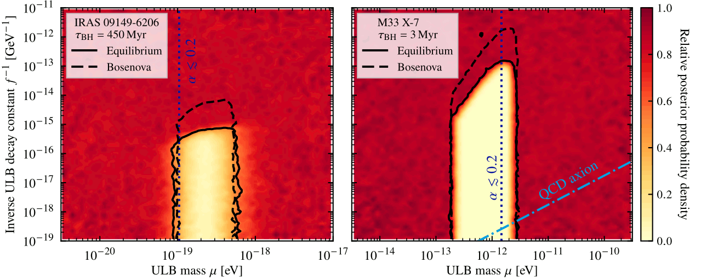

# Black Hole Superradiance for Ultralight Bosons

<em>A Python package and data repo for calculating BHSR rates and constraining the properties of ultralight bosons.</em>

<table>
   <tbody>
      <tr><th scope="row">Developer(s)</th><td>Sebastian Hoof</td></tr>
      <tr><th scope="row"> Maintainer(s)</th><td><a href = "mailto:s.hoof.physics@gmail.com">Sebastian Hoof</a></td></tr>
      <tr><th scope="row">Licence</th><td>BSD 3-clause licence, see <a href="LICENSE">the licence file</a> for details</td></tr>
   </tbody>
</table>

## Results

Details on our proposed inference framework, which directly uses black hole mass and spin posterior samples to constrain ultralight bosons, can be found in our preprint [[arXiv:2406.10337]](https://arxiv.org/abs/2406.10337).
More details to follow after the peer review process.

### Statistical analysis framework

<!--  -->

**PRELIMINARY.** The plot above shows the excluded parameter region for the ULB boson mass _&mu;_ and _f-1_ for IRAS 09149-6206 (left panel) and M33 X-7 (right panel).

## How to install

### Requirements

-  Python interpreter v3.10 (or higher)
-  Python packages iminuit, numba, numpy, qnm, scipy, superrad
-  _Optional_: Python packages emcee, jupyterlab, matplotlib, tqdm

### Step-by-step guide

1. Install the dependencies into your Python environment via `python -m pip install iminuit numba numpy qnm scipy superrad`
2. Clone this repo via `git clone https://github.com/sebhoof/bhsr`

## How to get started
We include the Jupyter notebook [examples.ipynb](examples.ipynb) to demonstrate a few of the capabilities of our code.

## How to cite

Even if you wish to *only* cite our code, we still ask you to cite [[arXiv:2406.10337]](https://arxiv.org/abs/2406.10337) and to include a link to this Github repo.
Sadly, code citations are still not widely recognised.

We (re-)distribute posterior samples from various BH data sets.
If you make use of the data included in the `data/` folder, the following works should be cited:

| Black hole name | Samples | Reference(s) |
| :--- | :--- | :--- |
| IRAS 09149-6206 | _M_ | [[arXiv:1705.02345]](https://arxiv.org/abs/1705.02345), [[arXiv:2009.08463]](https://arxiv.org/abs/2009.08463) |
| | _a*_ | [[arXiv:2009.10734]](https://arxiv.org/abs/2009.08463) |
| M33 X-7 | _(M,a*)_ | [[arXiv:0803.1834]](https://arxiv.org/abs/0803.1834) |
